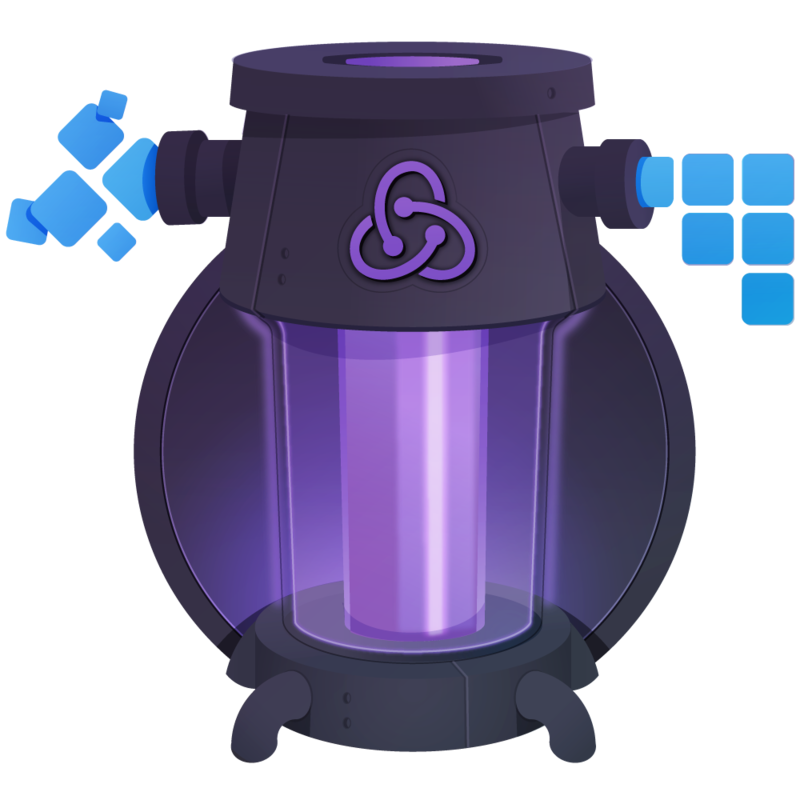

# Getting Started with Redux +
# Building React Applications with Idiomatic Redux

This TodoApp project was based on those *excelent* Egghead courses (made by [Dan Abramov](https://github.com/gaearon)):

- [Getting Started with Redux](https://egghead.io/courses/getting-started-with-redux).



- [Building React Applications with Idiomatic Redux](https://egghead.io/courses/building-react-applications-with-idiomatic-redux).


If you haven't watched them, what are you waiting for? Go check them out!


## Usage

```
$ yarn install
$ yarn start
```

## Notes for the curious developer

I added the `redux` and `react-redux` dependencies in the project but I'm not using them. The reason is that I implemented *everything from scratch* in order to understand what was happening under the hood.

Now I've a basic `redux` and `react-redux` implementation working!

The only problem I faced with this approach was that I'm not able to connect to the **Redux Dev Tools** anymore. I think it's because it's tightly coupled to the original Redux implementation. Maybe I'll come back and fix it.

If you intend to use the original `redux` and `react-redux` implementations, go to the `index.js` files under the `lib` folder and export the original functions/symbols of those libraries.

Yeah, the app *is not* pretty because I didn't expend the time styling it (I just wanted to *learn Redux*, so don't blame me).

If you want a better look version of this app (and with more features), take a look at my [react-todo](https://github.com/helton/react-todo) project.

## License

[](https://opensource.org/licenses/MIT) © [Helton Carlos de Souza](http://helton.me)

[](https://twitter.com/h3170n)